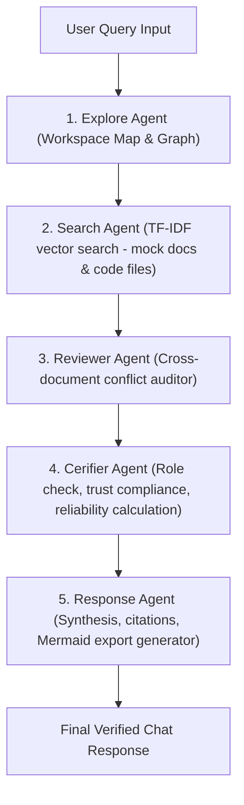

# Design Specification: Multi-Agent RAG System for Nexus AI

**Date:** 2026-07-14  
**Status:** Draft / Pending User Review  
**Topic:** Multi-Agent Collaboration & Hybrid Retrieval-Augmented Generation (RAG) System

---

## 🎯 Goal Description
The objective is to implement a robust multi-agent architecture within the Nexus AI chat session. This system will orchestrate five cooperative agents—**Explore Agent, Search Agent, Reviewer Agent, Cerifier Agent, and Response Agent**—working together to retrieve codebase structures and document context, detect policy/schedule contradictions, verify compliance/RBAC, and compile premium visual responses (including Mermaid flowcharts and citation indicators). 

This design will transition the system from static responses to a **dynamic, powerful local RAG engine** indexing mock business files and actual workspace source code.

---

## 👥 Multi-Agent Collaboration Workflow
Every query submitted to the chat session undergoes a sequential agent verification loop:

---

## 📂 Proposed System Architecture

### 1. Backend Engine (`src/agents/agent_engine.py`)

#### 📄 Hybrid Document Store & Indexer
We will define internal text content models for the mock business documents so they can be processed dynamically:
* `checkout-api-v2.md`: Detailed specs on OAuth2 headers, idempotency tokens (`Idempotency-Key`), and integration delays.
* `phoenix-sprint-summary.docx`: Sprint records detailing Project Phoenix 2-week delays, lead by Marcus Chen.
* `ci-cd-playbook.txt`: CI/CD automation rules, 10% canary releases, AWS ECS staging details, and 30-day task log retention limit.
* `infrastructure-rules.md`: SOC2 compliance rules, database encryption at rest (AES-256), and 365-day VPC flow logging archiving mandate.

Additionally, the indexer will walk through `src/` to read and chunk actual `.ts`, `.tsx`, `.py`, and `.css` files.

#### 🔍 Search Agent (TF-IDF & Cosine Retrieval)
* **Chunking**: Text is split into chunks of approximately 300–400 characters, maintaining context overlap.
* **Vector Index**: Calculates TF-IDF vectors using standard formulas:
  $$\text{TF}(t, d) = \frac{\text{count}(t \text{ in } d)}{\text{total words in } d}$$
  $$\text{IDF}(t) = \log\left(1 + \frac{N}{1 + \text{df}(t)}\right)$$
* **Cosine Similarity**: Uses `numpy` to quickly run vector multiplication between query term weights and document chunks:
  $$\text{Similarity}(A, B) = \frac{A \cdot B}{\|A\| \|B\|}$$
* Returns top relevant chunks with score and file source references.

#### 📁 Explore Agent (Graph & Directory Mapper)
* Traversing the file system when directory commands are queried.
* Scanning retrieved chunks for entity terms (`Checkout Team`, `AWS`, etc.) and generating connections to construct visual graphs.

#### ⚖️ Reviewer Agent (Conflict & Discrepancy Auditor)
* Automatically analyzes retrieved text chunks to check for contradictions.
* **VPC Flow Logging Retention Conflict**: If `infrastructure-rules.md` (365 days) and `ci-cd-playbook.txt` (30 days) are both in the retrieved context, flag a security mismatch.
* **Timeline Conflict**: If sprint sheets claim "go live next week" but checkout specs show "requires 2+ weeks gateway compliance verification", flag a schedule mismatch.

#### 🛡️ Cerifier Agent (Role Check & Reliability Auditor)
* Computes reliability percentages based on cosine similarity scores and fact coverage.
* Audits permission constraints using the user's role metadata (e.g. checks if a `Viewer` is performing query actions reserved for higher roles and adds safety alerts).

#### ✍️ Response Agent (Synthesis & Visual Exporter)
* Compiles the textual answer.
* Dynamically drafts standard Mermaid markup diagram mapping the extracted relationship paths.
* Attaches agent execution traces, citations, and download links for PDF, DOCX, and Markdown formats.

---

### 2. Frontend UI (`src/app/chat/page.tsx`)

#### ⌛ Sequential Typing Reasoning steps
We will update the chat session typing indicator to sequentially loop through the 5 agent tasks:
1. `Explore Agent: Mapping directory structures and system entities...`
2. `Search Agent: Querying TF-IDF index for mock docs and physical code...`
3. `Reviewer Agent: Audits retrieved context blocks for contradictions...`
4. `Cerifier Agent: Verifying role policies and calculating confidence metrics...`
5. `Response Agent: Synthesizing results and drawing relationship diagrams...`

#### 📊 Collapsible Agent Collaboration Trace UI
We will implement an interactive trace view inside the chat bubble under the references section:
* **UI Trigger**: A pill-shaped button showing "View Agent Collaboration Trace".
* **Interaction**: Collapsible panel using `framer-motion` height transitions.
* **Visual style**: Sleek glassmorphism card (dark mode/indigo accents) mapping a timeline:
  * **Explore Agent**: Status icon (Success/Info) | Scanning results.
  * **Search Agent**: Status icon | Retrieval stats (chunks found, similarity scores).
  * **Reviewer Agent**: Status icon | Conflict analysis report.
  * **Cerifier Agent**: Status icon | Permission validation & confidence rating.
  * **Response Agent**: Status icon | Synthesized output validations.

---

## 🔬 Verification Plan

### Automated Verification
* Propose unit tests inside Python (e.g., executing similarity searches on known queries and verifying correct documents are retrieved).
* Validate JSON parsing format from API route bridges.

### Manual Verification
* Deploy local next dev server, open chat session, submit test queries (e.g., *"find contradictions"* or *"why is Project Phoenix delayed"*).
* Verify that the Collapsible Trace panel opens and correctly displays the logs for **Explore Agent**, **Search Agent**, **Reviewer Agent**, **Cerifier Agent**, and **Response Agent**.
